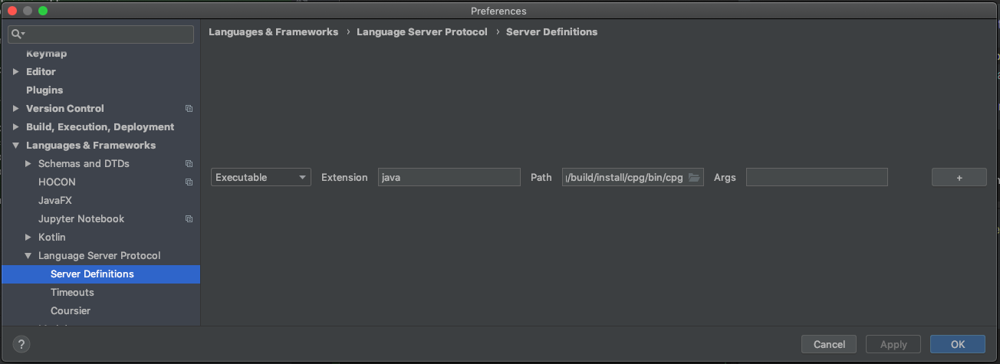

# Requirements

The jar runs without any dependencies, but expects a reachable Neo4J Server (with default credentials)

Start it locally with:

```
docker run -e NEO4J_AUTH=neo4j/password --publish=7474:7474 --publish=7687:7687 neo4j
```

Alternatively, you can set the environment-variables `NEO4J_URI`, `NEO4J_USERNAME`, `NEO4J_PASSWORD` to make the system connect to a different host

# Test manually

First, build a packaged version of the `cpg`:

```
./gradlew installDist
```

This will provide you with a shell wrapper around `java -jar` called `bin/cpganalysisserver` in the `build/install/cpganalysisserver` folder.

You can start the binary without arguments to go into the interactive console, or with -lsp to start the lsp server.


## Manual LSP Test

Test LSP. Paste the following into the stdin of the LSP server.

```
Content-Length: 58

{"jsonrpc":"2.0","id":2,"method":"initialize","params":{}}
```

The server should return with a list of capabilities.

To follow the examples, copy the `client.cpp` in this folder to `/tmp/client.cpp`. The `file:` URI scheme does not allow relative paths.

To simulate changing a document, the following snippet can be pasted:
```
Content-Length: 108

{"jsonrpc":"2.0","method":"textDocument/didOpen","params":{"textDocument":{"uri":"file:///tmp/client.cpp"}}}
```

This should trigger the LSP server to translate the document into the graph.

### Test in IntelliJ


1. Download and install the `LSP Support` plugin. Restart IntelliJ.
2. Goto `Settings` -> `Language Server Protocol` -> `Server Definitions`
3. Add a new server definition of type `Executable` for extension `java` and navigate to your local `build/install/cpganalysisserver/bin/cpganalysisserver` script. 
 


If everything works as intended, you should see a green circle in your IntelliJ status bar, indicating that the connection to the language server was successful. Afterwards each time you open a Java file, it should get translated into the neo4j graph, visible in the neo4j browser (http://localhost:7474/browser).

Additionally, the `cpganalysisserver` program should log debug messages into `logs/debug.log` in the folder of your current IntelliJ project.
 
```
2019-03-01 16:39:39,071 WARN  GenericEndpoint Unsupported notification method: workspace/didChangeWatchedFiles
2019-03-01 16:39:39,192 WARN  GenericEndpoint Unsupported notification method: workspace/didChangeWatchedFiles
2019-03-01 16:39:51,175 WARN  GenericEndpoint Unsupported notification method: workspace/didChangeWatchedFiles
2019-03-01 16:40:05,792 WARN  GenericEndpoint Unsupported notification method: workspace/didChangeWatchedFiles
2019-03-01 16:40:09,449 INFO  TranslationTextDocumentService Handling didOpen: DidOpenTextDocumentParams [
  textDocument = TextDocumentItem [
    uri = "file:///tmp/client.cpp"
    languageId = "cpp"
    version = -1
```

If IntelliJ complains "no connection after 10s" does not necessarily mean that it tried 10 seconds. It can also mean that the server did not start at all.
To debug what is sent to the LSP-Server, modify the /cpganalysisserver script and make the last line sth. like:

```
echo "Starting" > /tmp/bla
echo "$JAVACMD" "$@" > /tmp/bla
exec "$JAVACMD" "$@" | tee -a /tmp/bla
```
