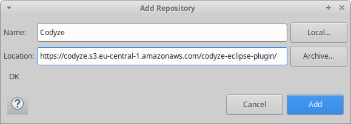
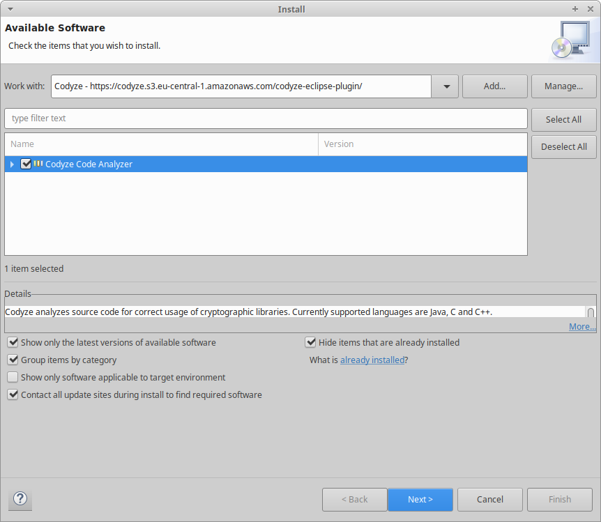
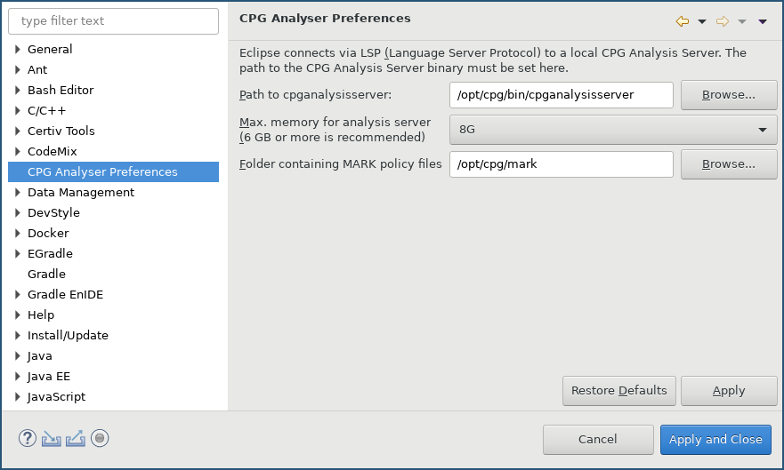
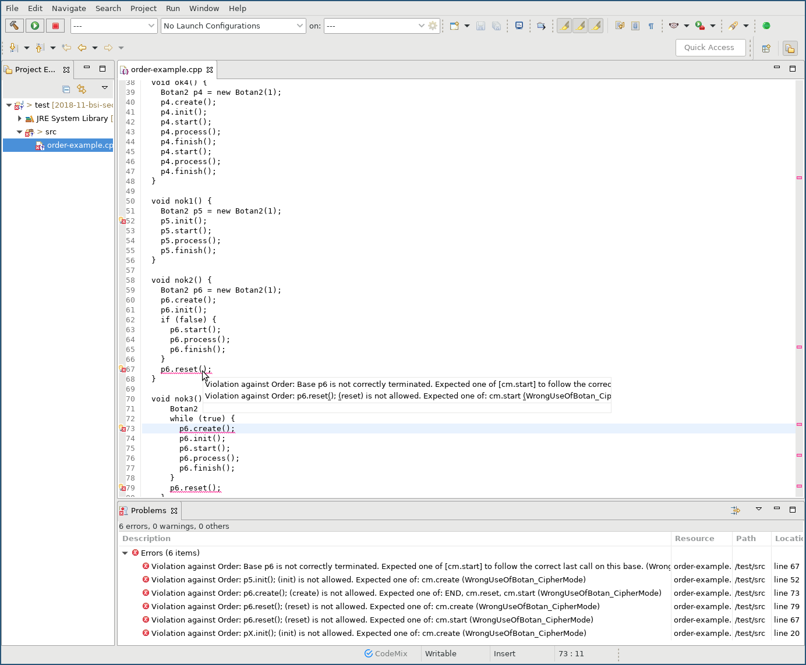
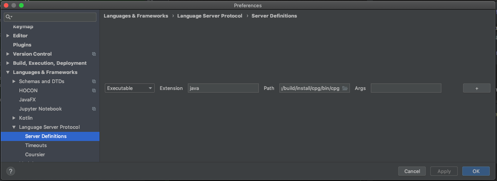
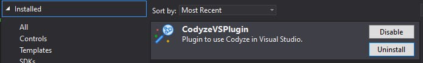

Codyze can be integrated into multiple IDEs to automatically scan your code for errors.

## Integration in Eclipse

The Codyze plugin can be installed from an Eclipse update site. It has been tested against Eclipse 2019-12 and later.

1. In Eclipse, click on `Help`->`Install New Software...`
2. Click `Add...` to add a new update site
3. Choose a name and enter the location [https://codyze.s3.eu-central-1.amazonaws.com/codyze-eclipse-plugin/](https://codyze.s3.eu-central-1.amazonaws.com/codyze-eclipse-plugin/) (note that this is an Eclipse update site URL and not suited to open with a web browser)

    <figure markdown>
      
      <figcaption></figcaption>
    </figure>

4. Choose and install `Codyze Code Analyzer`

     <figure markdown>
       
       <figcaption></figcaption>
     </figure>

Once installed, configure the Eclipse plugin to use the local LSP server:

1. Go to _Windows->Preferences->Codyze Code Analysis_ and configure the path to the analysis server binary

    <figure markdown>
        
        <figcaption></figcaption>
    </figure>

2. If the configuration is correct, `.java` and `.cpp` files will be automatically scanned when they are saved. Any errors found by Codyze will be highlighted as problems. If Codyze verifies that an API is correctly used, it will mark the line with a hint.

    <figure markdown>
        
        <figcaption></figcaption>
    </figure>

## Integration in IntelliJ

1. Download and install the `LSP Support` plugin. Restart IntelliJ.
2. Go to `Settings` -> `Language Server Protocol` -> `Server Definitions`
3. Add a new server definition of type `Executable` for extension `java` and navigate to your local `codyze-<version>/bin/codyze` script. 

    <figure markdown>
        
        <figcaption></figcaption>
    </figure>

If everything works as intended, you should see a green circle in your IntelliJ status bar, indicating that the connection to the language server was successful.

## Integration in Visual Studio 2019

The Codyze plugin can be installed from the Visual Studio 2019 Marketplace

<figure markdown>
   
   <figcaption></figcaption>
</figure>

If you prefer installing the plugin from the release page, proceed as follows:

1. Download the zipped extension from the [release page](https://github.com/Fraunhofer-AISEC/codyze-vs-plugin/releases)
2. Unzip the file
3. Double-click the VSIX-file to install the extension
4. Launch Visual Studio

On startup, the plugin will ask you for the path to Codyze and to the mark files you want to use. If everythings checks out, the plugin will automatically start an instance of Codyze when a solution is opened. It will then scan `.cpp` files when opened or saved and highlight potential problems.

To adjust the path to Codyze, the mark files or change the command line arguments used for Codyze, in Visual Studio go to `Tools` -> `Options...` -> `Codyze Plugin` -> `Codyze Settings`.

## Integration in Visual Studio Code

We build a Visual Studio Code plugin of Codyze for every new version. You can download a bundled `*.vsix` plugin from the [release page of Codyze <i class="fas fa-external-link-alt"></i>](https://github.com/Fraunhofer-AISEC/codyze/releases).

## Integration through LSP mode
Codyze offers an LSP mode. You can user the LSP mode to integrate Codyze into any IDE or text editor with support for LSP. You need to look up the recommended approach for your favorite IDE or text editor.

Once you know, how to configure an LSP tool, you need to start Codyze in LSP mode, i.e. `codyze-v2 -l` in __Codyze v2__ or `codyze lsp` in __Codyze v3__. Please refer to the [configuration page](configuration.md).