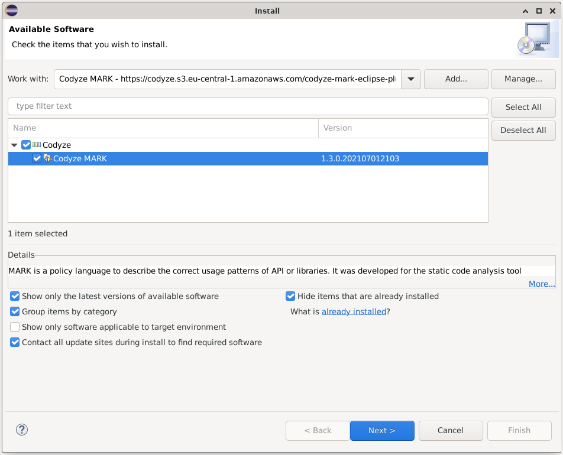

MARK is a simple domain specific language (DSL) that can be written in any text editor. We however recommend using the MARK Eclipse plugin which brings syntax highlighting, auto-completion, and some other benefits that will support you in writing MARK rules.

## Install the MARK Eclipse Plugin

* In Eclipse, click on `Help`->`Install New Software...`
* Add the update site: `https://codyze.s3.eu-central-1.amazonaws.com/codyze-mark-eclipse-plugin/`
* Install 

{ align=center }

## Start writing MARK policies

* Create a new project by clicking on `File`->`New`->`Project`. The project type does not matter.
* Create a new file with the extension `.mark`
* Confirm the dialog to configure Xtext for your project.
* Start writing [entities](Define Entities.md) and [rules](mark-authors.md). 

You may include all entities and rules in a single MARK file or organize them in multiple files as you with. As long as all MARK files are located in the same folder, Codyze will load entities and rules from all files in that folder.
