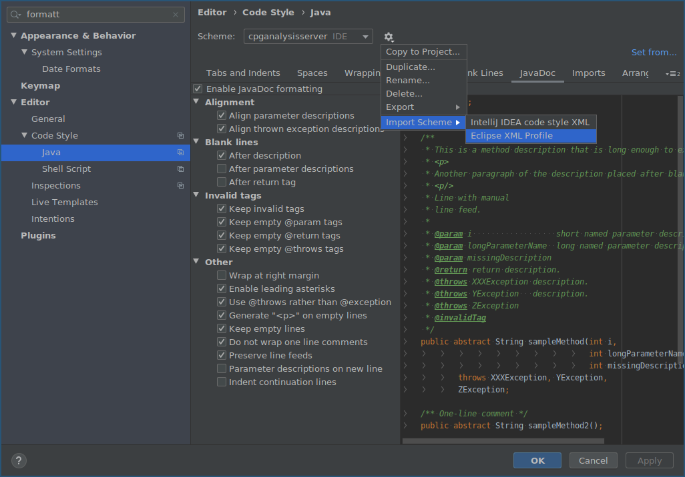
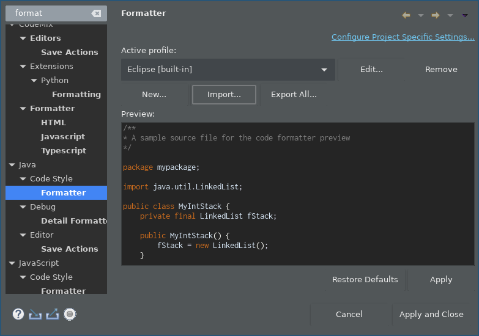

## Prerequisites

* Java (OpenJDK) 11 or later

## Check out, build, and extend Codyze

1. Fork the [Codyze repo <i class="fas fa-external-link-alt"></i>](https://github.com/Fraunhofer-AISEC/codyze){target=_blank} on GitHub and clone it, including submodules: `git clone --recurse-submodules git://github.com/<YOUR GITHUB>/codyze`
1. Create a branch for your contribution. We recommend prefixing the branch name with `fix-` if you are providing a bug fix or `feature-` if you plan to add a feature: `git checkout -b feature-MY_EPIC_FEATURE`
1. Make your changes and make sure that the project builds without errors, passes all tests, and is properly formatted: `./gradlew :codyze-cli:clean :codyze-cli:spotlessApply :codyze-cli:build :codyze-cli:installDist` 
The purpose of these gradle tasks is as follows:
    * _clean_ Removes previous build artifacts
    * _spotlessApply_ Applies source code formatting with the settings in `formatter-settings.xml`. If the code is not properly formatted the build server will reject it.
    * _build_ Builds the main artifact (the jar file containing Codyze)
    * _installDist_ Create an executable script for Linux, Mac, and Windows in `codyze-cli/build/install/codyze-cli/bin`
1. When everything works, `git commit` your changes and `git push` them to GitHub, then create a pull request (PR). Make sure to describe want you intend the code to do and refer to any issues your PR might address (using the notation `#123`)
1. If you're not yet ready for a review, add "WIP" to the PR name to indicate it's a work in progress.
1. Wait for the automated CI workflow to do some checks.
1. Continue working on your PR by pushing further commits to your branch until you are satisfied
1. When you're ready for a review, add a comment to the PR, and remove any "WIP" markers.

## Code formatting

Codyze uses the gradle _spotless_ plugin to format source code. You may import the code style definitions into your favorite IDE to apply it immediately.

### Gradle

* Simply run `./gradlew :codyze-cli:spotlessApply`

### IntelliJ

* In IntelliJ, open _Settings->Editor->Code Style->Java_ and click on the cog icon.
* Choose _Import Scheme->Eclipse XML Profile_ and select the file `formatter-settings.xml` in the project's root folder.

{ align=center }

### Eclipse

* In Eclipse, open _Window->Preferences->Java->Code Style->Formatter_
* Click _Import_ and select the file `formatter-settings.xml` in the project's root folder.

{ align=center }
